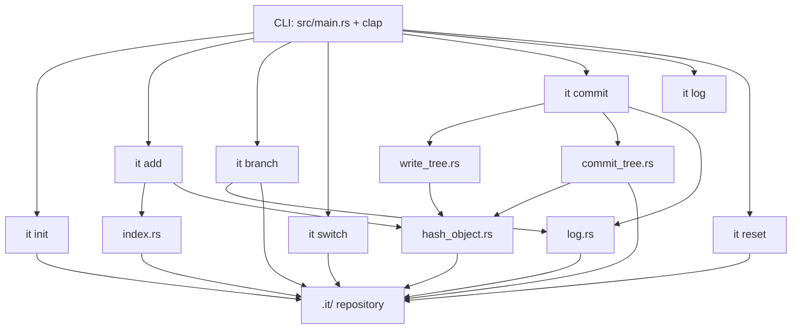

# it - Mini Git-like CLI in Rust

A lightweight, Git-style version control CLI built in Rust. Uses a local `.it/` directory to store objects, refs, and logs.

## Installation

```bash
git clone https://github.com/solana-turbin3/accel-challenge-week3-breakout4.git
cd accel-challenge-week3-breakout4
cargo install --path .
```

Make sure `~/.cargo/bin` is in your `PATH`. After installation, all commands are available as `it <command>`.

## Repository Structure

```
.it/
├── objects/          # blob, tree, and commit objects (zlib-compressed)
├── refs/
│   └── heads/        # branch refs (each file contains a commit hash)
├── logs/
│   ├── HEAD.md       # HEAD log
│   └── refs/
│       └── heads/    # per-branch reflog
├── HEAD              # symref pointing to current branch (e.g. ref: refs/heads/main)
└── index             # staging area
```

## Architecture



## Commands

### `it init`

Creates a new `.it` repository in the current directory.

```bash
it init
```

- Creates `.it/objects/`, `.it/refs/heads/`, `.it/logs/refs/heads/`
- Sets `.it/HEAD` to `ref: refs/heads/main`
- Initializes `.it/index` (staging area) and `.it/logs/HEAD.md`

---

### `it add <paths...>`

Stages one or more files or directories into the index.

```bash
it add src/main.rs
it add src notes.txt
```

- Recursively walks input paths
- Skips `.it` and `target` directories
- Hashes file contents as blob objects
- Updates entries in `.it/index`

---

### `it branch [name]`

Lists branches or creates a new one.

```bash
it branch              # list all branches (* marks current)
it branch feature-x    # create a new branch from current HEAD
```

- Without a name: prints all branches, marks current with `*`
- With a name: creates a new branch ref pointing to HEAD's current commit
- Logs the branch creation in `.it/logs/refs/heads/<name>`

---

### `it switch <name>`

Switches HEAD to an existing branch.

```bash
it switch feature-x
```

- Validates the branch exists in `.it/refs/heads/`
- Updates `.it/HEAD` to point to the target branch
- Prints a message if already on that branch

---

### `it commit -m <message>`

Creates a commit from staged index content.

```bash
it commit -m "Initial commit"
```

- Builds a tree object from index entries (`write_tree`)
- Reads parent commit hash from current branch ref
- Creates and stores a commit object with tree, parent, author, committer, and message
- Updates current branch ref to the new commit hash
- Appends commit info to the branch reflog

---

### `it log`

Prints reflog entries for the current branch.

```bash
it log
```

- Reads current branch from `.it/HEAD`
- Prints entries from `.it/logs/refs/heads/<branch>`

---

### `it reset`

Resets the current branch to its parent commit and restores the working tree.

```bash
it reset
```

- Reads the current commit from the branch ref
- Finds the parent commit hash from the commit object
- Updates the branch ref to the parent
- Restores the working tree (files and directories) from the parent's tree object
- Prints "no parent commit found" if at the root commit

---

## Typical Workflow

```bash
it init
it add src notes.txt
it commit -m "first commit"
it branch feature-x
it switch feature-x
it add src/commands
it commit -m "work on feature"
it log
it reset
```

## Environment Variables

Author and committer info for commit objects is read from:

- `GIT_AUTHOR_NAME` — defaults to `"Unknown"` if not set
- `GIT_AUTHOR_EMAIL` — defaults to `"Unknown"` if not set

Set them for the session:

```bash
export GIT_AUTHOR_NAME="Your Name"
export GIT_AUTHOR_EMAIL="you@example.com"
```
